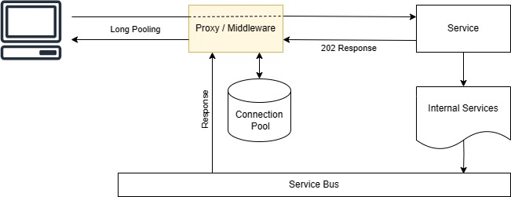

# AsyncRequestToSync
A service to transform async requests to sync HTTP requests.

It works as a middleware and tracks HTTP requests for the 202 status code. 
Then, read CorrelationId from the response header and hold the client request until gets a response asynchronously (or a configured timeout).



**Note:** You should not return any body with 202 status code.

## How to use
You need to register the ``AsyncConnectionHandler`` as a signletone and add ``AsyncRequestToSyncMiddleware`` middleware to pipline.

```C#
var builder = WebApplication.CreateBuilder(args);
var connectionHandler = new AsyncConnectionHandler();
servicebus.Subscribe<IMessage>(connectionHandler.HandleMessage) // Register HandleMessage
builder.Services.AddSingleton<IAsyncConnectionHandler>(connectionHandler); // add as singletone
var app = builder.Build();
app.UseMiddleware<AsyncRequestToSyncMiddleware>(); // Register Middleware
app.MapPost("/SampleEndpoint", async (HttpContext httpContext) =>
{
    var correlationId = Guid.NewGuid(); // Generating Unique Id for request

    // DO SOMETHING ASYNC LIKE SENDING A COMMAND

    httpContext.Response.StatusCode = 202; // returning 202 status code
    httpContext.Response.Headers.Add("CorrelationId", correlationId.ToString("N")); // returnig CorrelationId as header (DO NOT RETURN BODY)
});
```

Also, you can use it in ``YARP``:
```C#
app.MapReverseProxy(proxyPipeline =>
{
    proxyPipeline.UseMiddleware<AsyncRequestToSyncMiddleware>();
});
```

With some minor changes, you can use this module as a middleware in ``Azure Functions`` isolated worker.

## Discussion
Asynchronous requests and eventual consistency are common challenges between Front and Back teams.
The scenario could get more complicated when it comes to GraphQL.
Front-end teams usually favour synchronous requests and getting the result of their request commands immediately.
However, Back-end teams usually prefer asynchronous communication.

Here are some scenarios that are used; each has its Pros/Cons:

1. Client sends the command, mocks the response, and updates the UI immediately

2. Server gets the command, mocks the response, and answers immediately 

3. Server gets the command and returns 204. UI need to request after a time and hopefully get the result.

4. Server gets the command and returns 204 with a tracking ID.<br />
Client can check the status of the request from another endpoints.

5. Create a bi-directional connection between Client and Service (WebSocket / Server-Sent Events / ...).<br />
Server can respond to requests when it is ready.

6. Create a long pooling on the Server. <br />
**This middleware is a tool for implementing this method.**